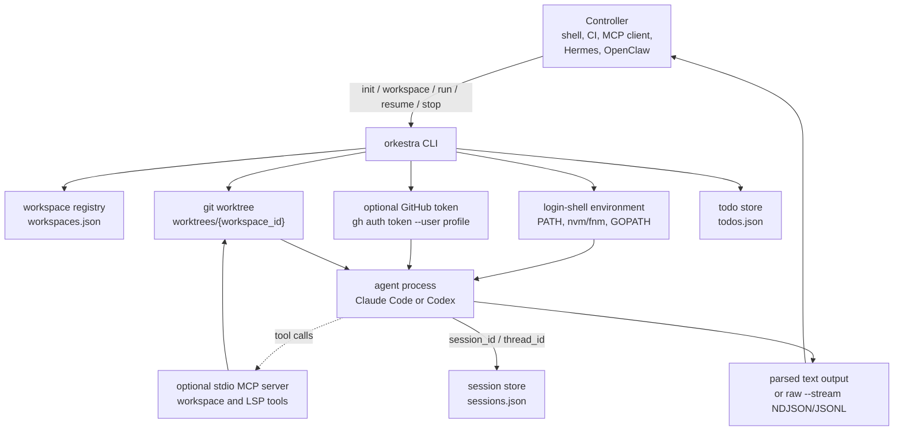

# Orkestra

**Orkestra** (from Indonesian *orkestrasi*, orchestration) is a CLI for running Claude Code and Codex in isolated git workspaces while keeping enough state to stop, resume, stream, and inspect those agent sessions from another process.

Use it when a controller such as a developer shell, CI job, MCP client, Hermes, OpenClaw, or other automation needs to launch an agent, follow its output, and come back to the same session later.

## What It Does

| Capability | What Orkestra handles |
|---|---|
| Isolated workspaces | Creates git worktrees under the Orkestra state directory |
| Agent execution | Runs Claude Code or Codex with the right prompt and working directory |
| Session resume | Stores Claude `session_id` and Codex `thread_id` per workspace |
| Streaming output | Emits parsed text by default or raw NDJSON/JSONL with `--stream` |
| GitHub auth | Injects `GH_TOKEN` per process from `gh auth token --user <profile>` |
| Shell environment | Captures login-shell env so tools from nvm, fnm, asdf, Go, and similar managers are available |
| MCP tools | Exposes workspace and LSP tools over stdio |
| Todos | Stores a small workspace-aware task list in JSON |

## How It Works



The important idea is that Orkestra is a CLI with persistent state. While `run` is active, it records process information so a separate `stop` command can target the child process. When the agent emits a session id or thread id, Orkestra stores it so `resume` can continue that workspace later.

## Requirements

- Go, for building the binary
- Git, for worktree creation
- Claude Code and/or Codex CLI, depending on which agent you run
- GitHub CLI, only when using `--gh-profile`
- `gopls`, only when using the Go LSP tools through MCP

## Installation

```bash
git clone https://github.com/adryanev/orkestra
cd orkestra
go build -o ~/.local/bin/orkestra ./main.go
```

## Quick Start

```bash
# Create the state directory and JSON state files.
orkestra init

# Create an isolated worktree for a repository.
orkestra workspace create \
  --repo ~/code/myproject \
  --name fix-auth \
  --gh-profile my-org

# Find the workspace id.
orkestra workspace list

# Run Claude Code in that workspace.
orkestra run \
  --workspace <workspace-id> \
  --agent claude \
  --prompt "Fix the auth middleware"

# Continue the saved session.
orkestra resume \
  --workspace <workspace-id> \
  --prompt "Continue with tests"

# Stop the running agent process for the workspace.
orkestra stop --workspace <workspace-id>
```

Use Codex by switching the agent:

```bash
orkestra run --workspace <workspace-id> --agent codex --prompt "Fix the failing test"
```

## Commands

| Command | Purpose |
|---|---|
| `orkestra init` | Creates the Orkestra state directory and initial JSON files |
| `orkestra workspace create` | Creates a git worktree and registers it as a workspace |
| `orkestra workspace list` | Lists registered workspaces |
| `orkestra run` | Starts Claude Code or Codex in a workspace |
| `orkestra resume` | Continues the saved session for a workspace |
| `orkestra stop` | Stops the persisted agent process for a workspace |
| `orkestra todo ...` | Creates, lists, updates, and deletes todos |
| `orkestra mcp --workspace <workspace-id>` | Starts the stdio MCP server for one workspace |

## Workspaces

A workspace is a registered git worktree with an id, name, branch, status, optional GitHub profile, and saved agent session.

```bash
orkestra workspace create \
  --repo ~/code/project \
  --name fix-payment-flow \
  --branch feature/fix-payment-flow \
  --gh-profile work
```

If `--branch` is omitted, Orkestra creates a branch from the workspace name, for example `orkestra/fix-payment-flow`. Worktrees are created under `~/.orkestra/worktrees/` by default.

## Streaming Output

By default, `orkestra run` parses agent output and prints the useful text, usage, tool calls, and session metadata.

Use `--stream` when another process needs the raw agent event stream:

```bash
orkestra run --workspace <workspace-id> --prompt "Fix it" --stream
```

Claude emits NDJSON. Codex emits JSONL.

## Git Auth

Workspaces can be tied to a GitHub CLI profile:

```bash
orkestra workspace create --repo ~/code/project --name fix --gh-profile my-org
```

When an agent runs in that workspace, Orkestra resolves the token with:

```bash
gh auth token --user <profile>
```

The token is injected as `GH_TOKEN` only for the spawned agent process. Orkestra does not call `gh auth switch` or change global GitHub CLI state.

## MCP and LSP

`orkestra mcp --workspace <workspace-id>` starts a stdio MCP server bound to one workspace. It exposes workspace utilities and LSP tools for agents:

- `get_workspace_info`
- `rename_branch`
- `notify`
- `lsp_goto_definition`
- `lsp_hover`
- `lsp_find_references`
- `lsp_references`
- `lsp_diagnostics`
- `lsp_rename`

The LSP tools use the configured language server for the file type and are scoped to the server's workspace.

## State Files

Orkestra stores state in `~/.orkestra` by default:

```text
~/.orkestra/
  workspaces.json
  sessions.json
  todos.json
  worktrees/{workspace_id}/
```

Set `XORKESTRA_HOME` to use a different state directory:

```bash
XORKESTRA_HOME=/tmp/orkestra orkestra init
```

## Design Notes

- Single Go binary for Linux and macOS
- JSON state files for simple inspection and recovery
- Atomic, locked writes for workspace, session, and todo state
- Stdio MCP transport so agents do not need a port
- Pipe-friendly agent invocation through Claude Code `-p` and Codex `exec`
- Login-shell environment capture so user-installed tools are available to agents
- Per-process GitHub token injection instead of global auth switching

## License

MIT
