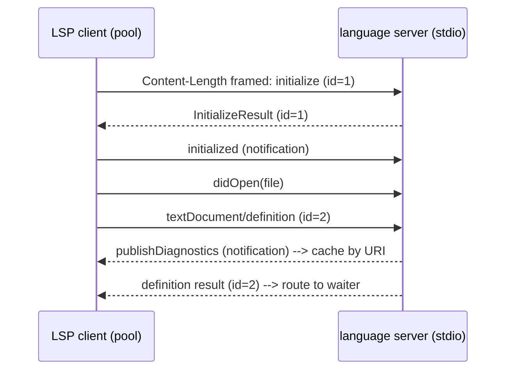

# fix: Make orkestra stable and functional

## Summary

Orkestra compiles cleanly but its core flow does not work: `workspace create` runs git in the wrong directory, `resume` never passes the saved session ID, `stop` does not kill anything, `--stream` is ignored, and the session-ID parser races with process exit. The two headline features — the MCP server and the LSP tools — cannot talk to a real client or to gopls. This plan fixes every confirmed defect, makes JSON state safe under parallel invocation, rebuilds the MCP server on the official Go SDK, rebuilds the LSP client as a registry-driven multi-language layer (Go, TypeScript/JavaScript/Node, Python, HTML) ported from Korlap's design, and adds a test suite plus CI.

---

## Problem Frame

Orkestra is the control layer between the Hermes orchestrator and coding agents (Claude Code, Codex). Hermes invokes `orkestra` as a series of separate, often parallel, short-lived processes. The current implementation was written feature-by-feature without integration testing, so several units are individually plausible but break when wired together or when run as the orchestrator actually runs them (separate processes, concurrent state writes, real MCP/LSP peers). There are zero tests, so regressions are invisible. The goal is a binary whose documented commands all work and stay working.

---

## Requirements

### Core flow correctness
- R1. `workspace create` creates the worktree from the target repository given by `--repo`, not from orkestra's current directory, and auto-detects the default branch with an `origin/HEAD → origin/main → origin/master` fallback.
- R2. `resume` passes the saved `session_id` (Claude) or `thread_id` (Codex) to the agent so the prior session actually continues.
- R3. `stop` terminates the running agent process for a workspace, even though `run` and `stop` are separate OS processes.
- R4. `run --stream` emits the agent's raw NDJSON/JSONL to stdout; without `--stream` it emits the parsed human-readable form.
- R5. Session ID, thread ID, and usage are captured deterministically, with no data race between the output parser and process exit.

### State safety
- R6. Concurrent `orkestra` invocations cannot corrupt or clobber `workspaces.json`, `sessions.json`, or `todos.json`; writes are atomic and serialized by a lock.
- R7. All persistent state resolves under one config directory (`XORKESTRA_HOME` or `~/.orkestra`); no file path is hardcoded to `~/.orkestra` independently.

### Auth and environment
- R8. The resolved `GH_TOKEN` reaches the spawned agent's environment on both `run` and `resume`.
- R9. The spawned agent inherits the orchestrator process environment plus captured login-shell variables plus injected auth, with no variable silently dropped.
- R10. Shell-environment capture cannot hang the command and fails closed to the current environment within a bounded time.

### Robustness and gaps
- R11. Every external command (git, gh, gopls handshake, shell capture) runs under a context deadline.
- R12. No tool is a stub: `notify` writes to a per-workspace log file rather than printing to stdout.
- R13. `workspace create` with no `--branch` generates a valid default branch name instead of failing on an empty `-b`.
- R14. `workspace remove` exists: it removes the git worktree, deregisters the workspace, and cleans associated session/process state.

### Interface
- R15. Every command supports `--json` for structured output, consistent in shape.

### Protocol
- R16. The MCP server speaks JSON-RPC 2.0 MCP (initialize / tools/list / tools/call) via the official Go SDK, so a real agent can connect.
- R16a. `run` and `resume` wire the MCP server into the spawned agent so the agent can call back: Claude via an injected `--mcp-config`, Codex via `codex mcp add` with cleanup after exit. Without this, the rebuilt server is never reachable.
- R17. The LSP tools communicate with the correct language server for the target file using correct LSP base-protocol framing and handshake, and return usable results for definition, hover, references, diagnostics, and rename.
- R17a. Language servers are supported for Go (`gopls`), TypeScript/JavaScript/Node (`typescript-language-server`), Python (`pyright`), and HTML (`vscode-html-language-server`), selected by file extension, with the server command set overridable by config.
- R17b. When the language server for a requested file is not installed, the tool returns a clear, actionable error rather than hanging or crashing.

### Security
- R20. Caller-supplied MCP tool arguments are validated before use: `notify` accepts only a registered workspace id with no path-separator characters (no arbitrary-file-write), and `rename_branch` rejects names that fail `git check-ref-format`.
- R21. Injected credentials never reach an output sink: not the notify log, streaming stdout, usage report, or `--json` output.

### Quality
- R18. A Go test suite covers the parsers, workspace/session manager, persistence locking, todo CRUD, env capture, and git-auth resolution.
- R19. CI runs build, vet, lint, and tests on every push.

---

## Key Technical Decisions

- KTD1. Adopt the official Go MCP SDK (`github.com/modelcontextprotocol/go-sdk`, v1.6.x; import `.../mcp`). It is GA, requires Go 1.25+ (the repo is on 1.26.2), derives tool JSON Schemas from Go structs by reflection, and serves stdio via `mcp.NewServer` + `mcp.AddTool` + `server.Run(ctx, &mcp.StdioTransport{})`. This replaces the bespoke `{tool_name,arguments}` protocol that no MCP client can speak. (see origin: research — go-sdk v1.6.1, MCP spec 2025-11-25)
- KTD2. The LSP layer is language-server-agnostic and config-driven, ported from Korlap's `src-tauri/src/lsp/` design. A registry of `LspServerConfig` entries (`command`, `args`, `extensions`, `detect_files`, `language_id`, `install_hint`) selects the server for a file by its extension. Built-in entries: Go (`gopls`), TypeScript/JavaScript/Node (`typescript-language-server --stdio`, extensions `ts,tsx,js,jsx,mjs,cjs,mts,cts`), Python (`pyright-langserver --stdio`), HTML (`vscode-html-language-server --stdio`). User config overrides merge over built-ins, user winning on key collision.
- KTD2a. A server pool keyed by `(workspace_id, server_id)` starts each language server lazily, reuses it across calls, and validates the binary on PATH before spawn — returning the entry's `install_hint` when the binary is absent (R17b). The transport is shared across all servers: `Content-Length: N\r\n\r\n<body>` framing, one persistent reader goroutine per server that demultiplexes responses by JSON-RPC `id` and caches `textDocument/publishDiagnostics` by URI, and the `initialize` → await response → `initialized` handshake. Each query opens the target document (`didOpen` with the registry `language_id`, content read from disk) and closes it (`didClose`) afterward. The server's stdin writer is guarded by its own lock, separate from the handle lock, so a large `didOpen` write cannot deadlock against the reader goroutine draining stdout (a concurrency hazard Korlap documents for pyright). A request registers a buffered waiter channel under the handle lock, releases it, then writes under the stdin lock and waits on the channel with a timeout holding no lock — never both locks at once.
- KTD2b. The reader goroutine handles three message shapes, not two: a response (`id` + `result`/`error`) routes to its waiter; a **server-initiated request** (`id` + `method`, e.g. `client/registerCapability`, `window/workDoneProgress/create`) must be answered with `result: null` or the server deadlocks waiting for the reply; a notification (`method`, no `id`) routes `publishDiagnostics` to the per-URI cache and logs the rest. Language-server-specific setup after `initialized`: send `workspace/didChangeConfiguration` with pyright's `diagnosticMode: openFilesOnly` (without it pyright crawls the whole project and blocks every request for minutes), and when a `.venv`/`venv` with `pyvenv.cfg` exists in the worktree, set `VIRTUAL_ENV` and prepend its `bin` to the server's PATH so pyright resolves imports. `lsp_diagnostics` opens the document, waits a bounded interval for at least one `publishDiagnostics` for the URI (Korlap uses a fixed 500 ms sleep; a bounded poll of the cache is more reliable), then returns the cache. `lsp_rename` returns a `WorkspaceEdit` that the tool applies to files on disk (handling both `changes` and `documentChanges`, applying text edits bottom-up). Positions are 0-based on the wire and 1-based at the tool boundary; file URIs are percent-encoded `file://` paths.
- KTD3. Persist JSON state with write-to-temp-then-`rename` (atomic on POSIX) guarded by an advisory file lock (`flock`) on a per-file lock file. The orchestrator spawns parallel `orkestra` processes, so in-process mutexes are insufficient — the lock must be cross-process.
- KTD4. Track the agent child by persisting its PID (and using a process group via `SysProcAttr.Setpgid`) to `sessions.json`. Because `run` and `stop` are separate processes, `stop` reads the PID and signals the process group (`syscall.Kill(-pgid, SIGTERM)`, then `SIGKILL` after a bounded grace period so `stop` cannot hang on a process ignoring SIGTERM). Persist a start-time alongside the PID and verify it before signaling so a recycled PID is never killed; `run` clears the PID on exit, and a `run`/`stop` that finds a stale or recycled record treats it as idempotent success. `run` must not hold the runner lock for the duration of agent execution. Korlap avoids all of this by holding the child handle in memory in a long-lived process — orkestra cannot, because each command is a separate short-lived process, which is the root reason PID persistence and identity verification are required here.
- KTD5. Compose the child environment as `os.Environ()` overlaid with captured login-shell variables overlaid with `GH_TOKEN`. Resolve the token in both `run` and `resume`. Either use `gitauth.BuildEnvVars` at this seam or delete it; no dead code.
- KTD6. The stdout-parser goroutine drains stdout to EOF before the process is reaped: `executeAgent` calls `wg.Wait()` (parser done) **before** `cmd.Wait()`. The agent closes stdout on exit, so the parser reaches EOF naturally; only then is it safe to `Wait()`. Calling `cmd.Wait()` first closes the read end of the pipe and can truncate the final line — precisely the Claude `result` / Codex `turn.completed` line carrying usage and the session id. This ordering (drain-then-wait) is what Korlap's reader thread does, and it removes the read/write race on `sessionInfo`.
- KTD7. Thread a `context.Context` with a deadline through every `exec.CommandContext` call and through the agent runner so cancellation and timeouts are real.
- KTD8. Keep stdout pure on the `mcp` command: the SDK owns stdout for the JSON-RPC stream; all server logging goes to stderr (or a log file). This also governs the LSP client, whose `gopls` stdout is the LSP channel.
- KTD9. Test with the Go standard `testing` package. Characterize the NDJSON/JSONL parsers against captured fixture lines. Filesystem-touching tests use `t.TempDir()` and an injectable config directory; external-binary tests are gated behind a helper that skips when the binary is absent.

---

## High-Level Technical Design

### Agent process lifecycle across separate CLI invocations

`run` and `stop` are independent OS processes, so the PID must survive in `sessions.json` between them. The runner must not hold its lock across `cmd.Wait()`, or a concurrent `stop` could not proceed.

```mermaid
sequenceDiagram
    participant H as Hermes
    participant R as orkestra run (proc A)
    participant FS as sessions.json (locked)
    participant Ag as agent (pgid)
    participant S as orkestra stop (proc B)

    H->>R: run --workspace ws1
    R->>Ag: start agent (Setpgid)
    R->>FS: persist {session_id, pid, pgid} (flock + atomic)
    R-->>R: parser goroutine reads stdout
    R->>R: cmd.Wait() (no lock held)
    H->>S: stop --workspace ws1
    S->>FS: read pid/pgid (flock)
    S->>Ag: kill(-pgid, SIGTERM) then SIGKILL
    R->>FS: on exit, clear pid; save session_id
```

### LSP client framing and handshake

The current client writes newline-delimited JSON and opens a fresh scanner per call; every language server requires `Content-Length` framing and server-initiated diagnostics. The pool selects the server by file extension; one reader goroutine per server demultiplexes.



---

## System-Wide Impact

- The state-persistence change (KTD3) touches every command that reads or writes `workspaces.json`, `sessions.json`, or `todos.json`. The on-disk format is unchanged; only the read/write path gains locking and atomic replace.
- The environment-composition change (KTD5) affects every spawned agent. A regression here makes agents lose their PATH or auth, so it carries direct test coverage.
- The stdout-discipline rule (KTD8) is a cardinal constraint for the `mcp` command and the LSP client: any stray `fmt.Print` to stdout corrupts the protocol stream.

---

## Implementation Units

### U1. Fix worktree creation directory and branch handling

**Goal:** `workspace create` operates on the `--repo` repository and tolerates a missing `--branch`.
**Requirements:** R1, R13.
**Dependencies:** none.
**Files:** `pkg/workspace/workspace.go`, `pkg/workspace/workspace_test.go`.
**Approach:** Set `cmd.Dir = repoPath` (or `git -C repoPath`) on both the `symbolic-ref` detection and the `worktree add`. Implement the default-branch fallback chain: try `git symbolic-ref refs/remotes/origin/HEAD`; on failure, probe `origin/main` then `origin/master`. When `--branch` is empty, derive a default name (for example from `--name`, slugified, or a generated suffix) so the `-b` argument is never empty. Validate that `repoPath` exists and is a git repository before creating the worktree; return a clear error otherwise.
**Patterns to follow:** existing error-wrapping style in `pkg/workspace/workspace.go` (`fmt.Errorf("...: %w", err)`).
**Test scenarios:**
- Happy path: given a temp git repo with a default branch, `CreateWorkspace` creates a worktree directory under the config dir and registers the workspace with the resolved branch.
- Default branch fallback: repo where `origin/HEAD` is unset but `origin/main` exists resolves to `origin/main`; repo with only `origin/master` resolves to `origin/master`.
- Empty branch: `CreateWorkspace` with empty branch produces a non-empty, valid branch name and the `worktree add` succeeds.
- Error: non-existent `repoPath` returns an error and registers nothing.

### U2. Atomic, lock-guarded JSON persistence

**Goal:** Concurrent `orkestra` processes cannot corrupt or lose state writes.
**Requirements:** R6.
**Dependencies:** none.
**Files:** `pkg/state/store.go` (new), `pkg/state/store_test.go` (new), `pkg/workspace/workspace.go`.
**Approach:** Provide a lock-spanning transaction primitive — `withLock(path, func(state) state)` — that holds an advisory `flock` on a sibling lock file across the **entire** read-modify-write: acquire lock, read the current file from disk, apply the mutation, write to a temp file in the same directory, `os.Rename` into place, release. Per-operation locking (lock-read-unlock, then lock-write-unlock) is insufficient: two processes that each loaded an older snapshot would clobber each other on save. Every mutating method (`CreateWorkspace`, `AddSession`, `UpdateWorkspaceStatus`, todo CRUD) must re-read under the lock rather than writing a stale in-memory map. The whole-map in-memory cache in `pkg/workspace/workspace.go` cannot be trusted across processes. Keep the existing JSON shape (map keyed by ID). The in-process `sync.Mutex` stays for goroutine safety within one process; the file lock adds cross-process safety.
**Execution note:** Add a concurrency characterization test first — spawn N goroutines (and, where feasible, a subprocess) writing distinct keys and assert no lost updates — before changing `Save`.
**Patterns to follow:** `pkg/workspace/workspace.go` load/save structure.
**Test scenarios:**
- Happy path: write then read round-trips a workspace map unchanged.
- Atomicity: a write interrupted mid-temp-file leaves the previous valid file intact (simulate by writing to temp and not renaming).
- Concurrency: N concurrent writers each adding a distinct key result in all keys present after the last write (with read-modify-write under the lock).
- Lock contention: two writers serialize rather than interleave; final file is valid JSON.

### U3. Unify state paths under the config directory

**Goal:** `todos.json` and all state resolve under the same config dir, honoring `XORKESTRA_HOME`.
**Requirements:** R7.
**Dependencies:** U2.
**Files:** `cmd/todo.go`, `cmd/root.go`, `cmd/init.go`, `cmd/todo_test.go` (new).
**Approach:** Replace the hardcoded `~/.orkestra/todos.json` in `cmd/todo.go` with the resolved `configDir` already computed in `cmd/root.go`. Ensure `init` creates `todos.json` alongside the other state files. Route todo load/save through the U2 helper for the same locking guarantees.
**Patterns to follow:** `getConfigDir()` in `cmd/init.go`, `configDir` resolution in `cmd/root.go`.
**Test scenarios:**
- Happy path: with `XORKESTRA_HOME` set, todo create writes under that directory, not `~/.orkestra`.
- Consistency: `init` creates `todos.json`, `workspaces.json`, and `sessions.json` in the same resolved directory.

### U4. Pass the saved session ID on resume

**Goal:** `resume` continues the prior agent session.
**Requirements:** R2.
**Dependencies:** none.
**Files:** `pkg/runner/claude_runner.go`, `cmd/resume.go`.
**Approach:** Change the runner so resume passes the actual identifier: Claude `--resume <session_id>`; Codex `exec resume <thread_id> --json <prompt>`. The runner reads the saved `Session` for the workspace and selects `session_id` or `thread_id` by agent. `cmd/resume.go` must stop discarding the looked-up session — it passes it down (or the runner fetches it). When no saved session exists, return a clear error rather than silently starting fresh, unless the caller opts into a fresh start.
**Patterns to follow:** `Runner.Run` argument threading in `pkg/runner/claude_runner.go`.
**Test scenarios:**
- Claude resume: given a saved `session_id`, the constructed argument vector contains `--resume <id>`.
- Codex resume: given a saved `thread_id`, the argument vector is `exec resume <thread_id> --json <prompt>` in that order.
- Missing session: resume with no saved session returns an error (or the explicit fresh-start path) rather than `--resume` with an empty value.

### U5. Fix the runner data race and report usage

**Goal:** Session/thread/usage capture is deterministic; the result usage is surfaced.
**Requirements:** R5.
**Dependencies:** none.
**Files:** `pkg/runner/claude_runner.go`, `pkg/runner/claude_runner_test.go` (new).
**Approach:** Wrap the stdout-parser goroutine in a `sync.WaitGroup` and call `wg.Wait()` (parser drains stdout to EOF) **before** `cmd.Wait()`, not after — see KTD6. Extract the NDJSON (Claude) and JSONL (Codex) line handlers into named functions that take a line and mutate a `*SessionInfo`, so they are unit-testable without spawning a process. Populate and print the usage report on completion; for Claude, sum `input_tokens + cache_creation_input_tokens + cache_read_input_tokens` for the real input total (Korlap does this — the naive `input_tokens`-only read undercounts), and distinguish cumulative (`result`) from incremental (`assistant`) usage.
**Execution note:** Characterize the parsers against captured fixture lines before refactoring.
**Patterns to follow:** existing switch-on-`type` parsing in `pkg/runner/claude_runner.go`.
**Test scenarios:**
- Claude parse: a `system` line with `session_id` sets `SessionInfo.SessionID`; an `assistant` text block is rendered; a `result` line populates usage.
- Codex parse: `thread.started` sets `ThreadID`; `item.completed`/`agent_message` renders text; `turn.completed` populates usage.
- Race: running the runner under `-race` against a fake agent script that emits a known session line reports the session ID on every run (no race, no empty capture).
- Edge: malformed JSON lines are skipped without aborting the parse loop.

### U6. Implement `--stream` raw passthrough

**Goal:** `--stream` emits raw agent output; default emits parsed output.
**Requirements:** R4.
**Dependencies:** U5.
**Files:** `pkg/runner/claude_runner.go`, `cmd/run.go`.
**Approach:** Honor the `stream` parameter in `executeAgent`. When true, copy stdout lines verbatim to the process stdout while still extracting the session ID (the session capture must work in both modes). When false, keep the current parsed rendering. Confirm the flag is threaded from `cmd/run.go` through `Run` to `executeAgent`.
**Patterns to follow:** the existing stdout goroutine in `pkg/runner/claude_runner.go`.
**Test scenarios:**
- Stream on: given fixture agent output, stdout receives the raw lines unchanged and the session ID is still captured.
- Stream off: stdout receives the parsed text, not raw JSON.

### U7. Real process tracking and working `stop`

**Goal:** `stop` terminates the agent started by a separate `run` process.
**Requirements:** R3.
**Dependencies:** U2, U4.
**Files:** `pkg/runner/claude_runner.go`, `pkg/process/process.go`, `pkg/workspace/workspace.go`, `cmd/stop.go`, `cmd/run.go`.
**Approach:** Start the agent with `SysProcAttr{Setpgid: true}` and persist the child PID and PGID to the workspace's `Session` record. `stop` reads the PID/PGID and sends `SIGTERM` to the process group, then `SIGKILL` after a grace period, then clears the PID. Do not hold the runner lock across `cmd.Wait()`. Decide the role of `pkg/process`: either route agent spawning through `ProcessManager` so it is the single owner of child processes, or remove the unused manager — do not leave it instantiated and unused in `cmd/root.go`.
**Patterns to follow:** `KillProcess` signaling in `pkg/process/process.go`; `Session` persistence in `pkg/workspace/workspace.go`.
**Test scenarios:**
- Happy path: a long-running fake agent is started by one code path; a second code path reads the PID and terminates the group; the process is gone afterward.
- Grace escalation: a process ignoring SIGTERM is killed by the follow-up SIGKILL.
- Stale PID: `stop` on a workspace whose recorded process already exited returns success (idempotent) and clears state.
- No-lock-held: a `stop` issued while the agent runs is not blocked by the runner lock.

### U8. Reliable environment and git-auth injection

**Goal:** The child agent always receives the full environment plus `GH_TOKEN` on both run and resume.
**Requirements:** R8, R9.
**Dependencies:** none.
**Files:** `pkg/runner/claude_runner.go`, `pkg/gitauth/auth.go`, `cmd/run.go`, `cmd/resume.go`, `pkg/gitauth/auth_test.go` (new).
**Approach:** Build `cmd.Env` as `os.Environ()` overlaid with captured login-shell variables overlaid with the resolved `GH_TOKEN`, rather than from captured shell variables alone (deduplicate by key so the last occurrence wins deterministically). Resolve the binary to an absolute path from the captured shell PATH and set it as the command (`env.Captured` already exposes `ClaudePath`/`CodexPath` via `command -v`): `exec.Command("claude", ...)` resolves the binary against orkestra's own PATH, not `cmd.Env`, so an agent installed via nvm/fnm/asdf fails with "executable file not found" even when `cmd.Env` is correct — Korlap resolves the absolute path for exactly this reason. Resolve the token in `resume` as well as `run` (move resolution into the runner or a shared helper so both paths use it). Use `gitauth.BuildEnvVars` at this seam or delete it. Credentials (`GH_TOKEN` and any token) must not be written to notify logs, streaming stdout, usage reports, or `--json` output.
**Patterns to follow:** token resolution in `cmd/run.go`; env assembly in `pkg/runner/claude_runner.go`.
**Test scenarios:**
- Composition: given a process env, a captured-shell map, and a token, the resulting env contains all process vars, the shell overrides, and `GH_TOKEN`.
- Precedence: a variable present in both process env and captured shell resolves to the intended source deterministically (documented order).
- Resume parity: the resume path injects `GH_TOKEN` when the workspace has a profile.
- No token: when no profile is set, no `GH_TOKEN` is injected and the rest of the env is intact.

### U9. Harden shell-environment capture

**Goal:** Capture cannot hang and is bounded.
**Requirements:** R10, R11.
**Dependencies:** none.
**Files:** `pkg/env/capture.go`, `pkg/env/capture_test.go` (new).
**Approach:** Keep the interactive login shell (`-lic`; fish: `--login --interactive -c`) — nvm/fnm/volta add their PATH entries in interactive rc files, not login profiles, so dropping `-i` loses the very PATH the capture exists to obtain (Korlap keeps it deliberately). Bound the hang risk instead: run every shell invocation under a `context` deadline (`exec.CommandContext`) and fall back to `os.Environ()` on timeout or error. Handle rc-file noise the way Korlap does — wrap the requested output in delimiter markers (`echo __ORK__; <cmd>; echo __ORK__`) and extract the text between them, so motd/nvm "Now using node…" lines do not corrupt the parsed env. Send the capture command's own stderr to null. Resolve `claude`/`codex` absolute paths via `command -v` (filtered for "not found"); reuse the already-captured PATH for the binary-resolution lookups rather than spawning extra unbounded shells. Keep `sync.OnceValue` caching. Filtering policy: decide explicitly whether to forward the full captured environment (current behavior — all user credentials reach the agent) or strip a credential denylist; record the choice in the plan rather than leaving it implicit.
**Patterns to follow:** existing `sync.OnceValue` block in `pkg/env/capture.go`; the minimal-env example in the Phase 2 parity doc.
**Test scenarios:**
- Happy path: capture returns a map containing PATH for the current shell.
- Timeout: a capture command that exceeds the deadline returns the current-environment fallback, not a hang.
- Parse: `key=value` lines parse correctly and shell-internal keys (`_`, `SHLVL`) are excluded.

### U10. Context deadlines on external commands

**Goal:** No external command can block indefinitely.
**Requirements:** R11.
**Dependencies:** U1, U9.
**Files:** `pkg/workspace/workspace.go`, `pkg/gitauth/auth.go`, `pkg/runner/claude_runner.go`, `pkg/mcp/server.go`.
**Approach:** Convert `exec.Command` to `exec.CommandContext` for git operations (worktree, branch rename, default-branch detection), `gh auth token`, and the gopls handshake, with sensible per-call deadlines. The long-lived agent process is governed by `stop`/cancellation rather than a fixed deadline; document that distinction.
**Patterns to follow:** the `exec.CommandContext` usage introduced in U9.
**Test scenarios:**
- Git timeout: a git invocation against an unresponsive path is cancelled by the deadline and returns an error.
- Token timeout: `ResolveToken` returns an error rather than hanging when `gh` does not respond.
- Test expectation: agent-process longevity is unaffected (no fixed deadline kills a healthy long run).

### U11. Implement `notify` to a per-workspace log file

**Goal:** `notify` persists messages instead of printing to stdout.
**Requirements:** R12.
**Dependencies:** U3.
**Files:** `pkg/mcp/server.go` (handler logic; final wiring lands in U14).
**Approach:** Write notifications to a per-workspace log file under the config dir (for example `logs/<workspace-id>.log`), one timestamped line per message. Before constructing the path, validate that the id is a registered workspace and contains no path-separator or `..` sequence, so a crafted id (`../../.ssh/authorized_keys`) cannot turn this logging tool into an arbitrary-file-write primitive. Never write to stdout from the MCP server, since stdout is the protocol channel.
**Patterns to follow:** config-dir resolution from U3.
**Test scenarios:**
- Happy path: `notify` appends a timestamped line to the workspace log file and returns a structured result.
- Missing args: absent `id` or `message` returns a clear error.
- Path traversal: an id containing `/` or `..`, or an id not in the workspace registry, is rejected before any path is constructed.
- No stdout: the handler writes nothing to stdout.

### U12. `--json` on all commands

**Goal:** Every command can emit structured JSON output.
**Requirements:** R15.
**Dependencies:** none.
**Files:** `cmd/root.go`, `cmd/workspace.go`, `cmd/run.go`, `cmd/resume.go`, `cmd/stop.go`, `cmd/init.go`, `cmd/todo.go`.
**Approach:** Add a persistent `--json` flag at the root and a single output helper that prints either the human form or `json.MarshalIndent`. Replace the placeholder `printJSON` in `cmd/root.go`. Define a stable result shape per command (for example workspace create returns the workspace object; stop returns `{workspace_id, status}`).
**Patterns to follow:** the existing `--json` branch in `cmd/todo.go` `list`.
**Test scenarios:**
- Each command with `--json` emits valid JSON of the documented shape.
- Each command without `--json` emits the existing human-readable form.
- Errors with `--json` are emitted as structured JSON on stderr with a non-zero exit.

### U13. `workspace remove`

**Goal:** Remove a workspace and its worktree cleanly.
**Requirements:** R14.
**Dependencies:** U1, U2, U7.
**Files:** `cmd/workspace.go`, `pkg/workspace/workspace.go`, `pkg/workspace/workspace_test.go`.
**Approach:** Add a `remove` subcommand taking `--id`. It runs `git worktree remove` (with a `--force` opt-in for dirty trees), deletes the workspace from the registry, removes any saved session, and signals any tracked process for that workspace first. Guard against removing a workspace with a live agent unless forced.
**Patterns to follow:** `workspaceCreateCmd` structure in `cmd/workspace.go`.
**Test scenarios:**
- Happy path: remove deletes the worktree directory, deregisters the workspace, and removes its session.
- Live agent: remove on a workspace with a running agent is refused without `--force` and terminates the agent with `--force`.
- Unknown id: remove on a missing id returns an error.
- Dirty tree: remove on a worktree with uncommitted changes is refused without `--force`.

### U14. Rebuild the MCP server on the official Go SDK

**Goal:** The MCP server speaks real JSON-RPC 2.0 MCP.
**Requirements:** R16, R12.
**Dependencies:** U11, U15.
**Files:** `pkg/mcp/server.go`, `cmd/mcp.go`, `go.mod`, `go.sum`, `pkg/mcp/server_test.go` (new).
**Approach:** Add `github.com/modelcontextprotocol/go-sdk` and rebuild the server: `mcp.NewServer(&mcp.Implementation{Name, Version}, nil)`, register each tool with `mcp.AddTool(server, &mcp.Tool{...}, handler)` using typed input/output structs (handler signature `func(ctx, *mcp.CallToolRequest, In) (*mcp.CallToolResult, Out, error)`), and serve with `server.Run(ctx, &mcp.StdioTransport{})`. Port the existing tools — `get_workspace_info`, `rename_branch`, `notify` (from U11), and the six LSP tools (handlers from U15) — to typed schemas. The server is started with a fixed workspace context (a `--workspace` flag or env var, as Korlap fixes `KORLAP_WORKSPACE_ID`); LSP tool arguments carry a file path relative to that workspace's worktree, not a workspace id, and the LSP pool lives in this process for the session. Validate tool inputs at the handler: `rename_branch` must reject names that fail `git check-ref-format --branch`; path-bearing tools must reject path traversal. Route all logging to stderr (KTD8). Note the SDK sets `additionalProperties:false`; if any tool must accept extra fields, override its input schema. Delete the hand-written request loop and `sendResponse`.
**Patterns to follow:** existing tool handler bodies in `pkg/mcp/server.go` (logic is reusable; only the transport and registration change). Research reference: go-sdk v1.6.1 API.
**Test scenarios:**
- Tool registration: the server advertises the expected tool set via `tools/list`.
- get_workspace_info: a `tools/call` with a valid id returns the workspace fields; an unknown id returns a tool error.
- rename_branch: a call renames the branch and updates persisted state.
- Schema: a call with a missing required field is rejected by schema validation before the handler runs.
- Stdout purity: server startup and tool calls write no non-protocol bytes to stdout.

### U15. Rebuild the LSP client: multi-language registry, server pool, correct framing

**Goal:** The LSP tools work for Go, TypeScript/JavaScript/Node, Python, and HTML, selecting the right server per file.
**Requirements:** R17, R17a, R17b.
**Dependencies:** none (consumed by U14).
**Files:** `pkg/mcp/lsp.go`, `pkg/mcp/lsp_registry.go` (new), `pkg/mcp/lsp_pool.go` (new), `pkg/mcp/lsp_test.go` (new).
**Approach:** Port Korlap's `src-tauri/src/lsp/` structure to Go. Three concerns:
- Registry (`lsp_registry.go`): the `LspServerConfig` type and `builtinConfigs()` for Go/TypeScript/Python/HTML, plus `resolveConfigs(userOverrides)` (user wins) and `configForExtension(ext)`. The server command set is overridable via orkestra config.
- Pool (`lsp_pool.go`): handles keyed by `(workspace_id, server_id)`; `getOrStart` validates the binary on PATH and returns the `install_hint` error when missing, otherwise spawns and caches the server. Idle/dead servers are reaped.
- Transport (`lsp.go`): shared `Content-Length` framed read/write; one persistent reader goroutine per server handling the three message shapes in KTD2b (response, server-initiated request answered with `result: null`, notification); the `initialize` → response → `initialized` handshake followed by the pyright `openFilesOnly`/venv setup; the two-lock send path from KTD2a. Per-query `didOpen` (registry `language_id`, content from disk) then `didClose`, tracking open documents to avoid double-open. A `wait_for_ready` poll (`workspace/symbol` with an empty query until it succeeds, bounded, then proceed) so the first real query does not race server indexing. Percent-encoded `file://` URIs; 1-based-to-0-based conversion at the tool boundary. Tools: `lsp_goto_definition`, `lsp_find_references`, `lsp_hover`, `lsp_workspace_symbols`, `lsp_diagnostics`, `lsp_rename` — each formatting the raw LSP JSON into agent-friendly text (relative path + 1-based line:col + context line for locations; severity-named diagnostics; rename returns an applied-edit summary).
**Patterns to follow:** Korlap `src-tauri/src/lsp/types.rs` (`LspServerConfig`, `builtin_configs`, `config_for_extension`), `detect.rs` (`validate_binary` with install hint), `server.rs` (server pool, stdin-behind-lock), `mod.rs` (`ensure_document_open`/`close_document`). Research reference: LSP 3.17 base protocol framing and handshake.
**Test scenarios:**
- Registry selection: `.go` resolves to the gopls config, `.tsx`/`.mjs` to the typescript config, `.py` to pyright, `.html` to the HTML config; an unknown extension returns no config with a clear error.
- Override: a user config for an extension wins over the built-in for the same extension.
- Missing binary: requesting a server whose binary is absent returns the `install_hint` error, not a hang or panic.
- Framing: a frame writer/reader round-trips a JSON-RPC message with the correct `Content-Length` byte count (not character count).
- Demux: two outstanding requests receive their responses by matching `id`, regardless of arrival order.
- Diagnostics routing: a `publishDiagnostics` notification is cached by URI and returned by `lsp_diagnostics`.
- Document lifecycle: a query issues `didOpen` with the registry `language_id` then `didClose`; a second query on the same open document does not double-open.
- Handshake order: a position query issued before `initialized` is not sent on the wire.
- Integration (skipped per server when its binary is absent): against a temp Go module `lsp_hover` returns type info; against a temp TS project `lsp_goto_definition` returns a location.

### U18. Wire the MCP server into the spawned agent

**Goal:** The agent launched by `run`/`resume` can actually call the orkestra MCP server.
**Requirements:** R16a.
**Dependencies:** U14.
**Files:** `pkg/runner/claude_runner.go`, `cmd/run.go`, `cmd/resume.go`, `pkg/mcp/config.go` (new), `pkg/mcp/config_test.go` (new).
**Approach:** Currently nothing connects the agent to the MCP server, so even a correct server is unreachable. Mirror Korlap's `build_mcp_server_map`: for Claude, write an MCP config JSON (`{"mcpServers":{"orkestra":{"type":"stdio","command":"orkestra","args":["mcp","--workspace","<id>"]}}}`) to the config dir and pass `--mcp-config <path>`; for Codex, register via `codex mcp add` before the run and unregister after exit (idempotent remove-then-add, prefixed name to avoid collisions). The spawned `orkestra mcp` inherits the workspace context from its `--workspace` flag. Disable the agent's built-in LSP tool so the orkestra LSP tools are used instead — extend the Claude `--disallowedTools` from `EnterWorktree,ExitWorktree` to `EnterWorktree,ExitWorktree,LSP` (Korlap does this because it manages LSP centrally).
**Patterns to follow:** Korlap `build_mcp_server_map` and `codex_register_mcp_servers`/`codex_unregister_mcp_servers` in `src-tauri/src/commands/agent_backend.rs`.
**Test scenarios:**
- Claude wiring: the constructed command includes `--mcp-config <path>` and the written JSON names the `orkestra` stdio server with the workspace id.
- Disallowed tools: the Claude command's `--disallowedTools` includes `LSP`.
- Codex wiring: registration runs before spawn and the cleanup name is returned for post-exit unregister.
- Config content: the generated MCP config round-trips to the expected structure.

### U16. Test suite

**Goal:** The confirmed-fragile units have regression coverage.
**Requirements:** R18.
**Dependencies:** U1–U15, U18.
**Files:** `pkg/runner/claude_runner_test.go`, `pkg/workspace/workspace_test.go`, `pkg/state/store_test.go`, `pkg/env/capture_test.go`, `pkg/gitauth/auth_test.go`, `cmd/todo_test.go`, `pkg/mcp/server_test.go`, `pkg/mcp/lsp_test.go`.
**Approach:** Consolidate the per-unit tests above and fill gaps: git-auth resolution (with an injectable command), todo CRUD round-trips, and any cross-unit integration that mocks alone would not prove. Use `t.TempDir()` and an injectable config directory; gate external-binary tests behind a skip helper. This unit is the coverage backstop — most scenarios are authored within their feature units; here they are completed and de-duplicated.
**Patterns to follow:** standard `testing` table tests; fixture files under `pkg/runner/testdata/`.
**Test scenarios:**
- gitauth: `ResolveToken` parses a token from a stubbed command and errors on failure.
- todo: create, list (with status and workspace filters), update, and delete round-trip through the store.
- Coverage gate: `go test ./...` passes with the race detector enabled.

### U17. CI, lint, and Makefile

**Goal:** Build, vet, lint, and tests run on every push.
**Requirements:** R19.
**Dependencies:** U16.
**Files:** `.github/workflows/ci.yml` (new), `Makefile` (new), `.golangci.yml` (new).
**Approach:** Add a GitHub Actions workflow that sets up Go (matching the `go.mod` version), then runs `go build ./...`, `go vet ./...`, `golangci-lint run`, and `go test -race ./...`. Add a `Makefile` with `build`, `test`, `lint`, and `vet` targets mirroring CI. Add a baseline `.golangci.yml`.
**Patterns to follow:** none in-repo; standard Go Actions setup.
**Test scenarios:**
- Test expectation: none — CI/build configuration. Verified by the workflow passing on push and the `Makefile` targets running locally.

---

## Risks & Dependencies

- The MCP SDK requires Go 1.25+; the repo declares 1.26.2, so this is satisfied, but CI must pin a Go version that exists on the runner. If `go 1.26.2` is not yet available on the CI image, align the `go.mod` and CI to an installed release.
- The SDK sets `additionalProperties:false` on generated input schemas. Tools that receive an envelope with extra fields will be rejected unless their schema is overridden (KTD1, U14).
- Process-group signaling and `flock` are POSIX features. Orkestra targets Linux and macOS, so this is acceptable; a Windows port would need separate handling. State this constraint rather than abstracting prematurely.
- Each language server is an independent runtime dependency (`gopls`, `typescript-language-server`, `pyright-langserver`, `vscode-html-language-server`); none is bundled. The pool validates the binary on PATH and returns the registry `install_hint` when a server is absent, so a missing server degrades to a clear per-language error rather than a failure of the whole tool. Integration tests skip per server when its binary is absent so the suite stays green on minimal machines.
- The interactive-shell capture (`-lic`) can behave differently across user shell configurations; U9's timeout-and-fallback bounds the blast of a misbehaving rc file.

---

## Scope Boundaries

In scope: every defect and gap enumerated in Requirements R1–R19.

### Deferred to Follow-Up Work
- Codex feature parity beyond fixing the existing resume/exec path.
- A Windows port (process groups and file locking are POSIX-specific here).
- Additional MCP tools or LSP servers beyond Go/gopls.
- A streaming protocol for `notify` back to the orchestrator (the log file is the current sink).

### Outside this work
- Any TUI or GUI surface (the comparison with Korlap's desktop app is informational, not a target).
- Replacing JSON files with a database.

---

## Sources / Research

- Go MCP SDK: `github.com/modelcontextprotocol/go-sdk` v1.6.1 (GA, MCP spec 2025-11-25), import `.../mcp`; `mcp.NewServer`, `mcp.AddTool`, `mcp.StdioTransport`, `server.Run`; reflection-based schemas via `google/jsonschema-go` with `additionalProperties:false`; min Go 1.25.
- LSP 3.17 base protocol: `Content-Length` framing (byte count), `initialize` → response → `initialized` ordering, server-initiated `textDocument/publishDiagnostics`.
- gopls: plain `gopls` is the stdio server; `gopls serve` is the socket daemon. `gopls` confirmed installed at runtime.
- Korlap LSP design (ported): `src-tauri/src/lsp/types.rs` (`LspServerConfig` with `command`/`args`/`extensions`/`detect_files`/`language_id`/`install_hint`/`project_roots`; `builtin_configs` for rust/typescript/go/python; `config_for_extension`), `detect.rs` (`validate_binary` returns an install hint when the binary is absent), `server.rs` (server pool keyed by `(repo, server_id)`, stdin guarded behind its own lock to avoid a pyright pipe deadlock), `mod.rs` (`didOpen`/`didClose` lifecycle, 0-based positions at the protocol with 1-based at the agent boundary). Built-in language servers: `typescript-language-server --stdio` (ts/tsx/js/jsx/mjs/cjs/mts/cts), `pyright-langserver --stdio`, `gopls`, plus `vscode-html-language-server --stdio` added for HTML.
- Current defects verified in-repo: worktree git commands lack `.Dir` (`pkg/workspace/workspace.go`); resume appends `--resume` without an id (`pkg/runner/claude_runner.go`, `cmd/resume.go`); `stream` param unused (`pkg/runner/claude_runner.go`); `ProcessManager` instantiated but unused (`cmd/root.go`); MCP uses a custom non-JSON-RPC protocol (`pkg/mcp/server.go`); LSP lacks Content-Length framing (`pkg/mcp/lsp.go`); zero `_test.go` files.
